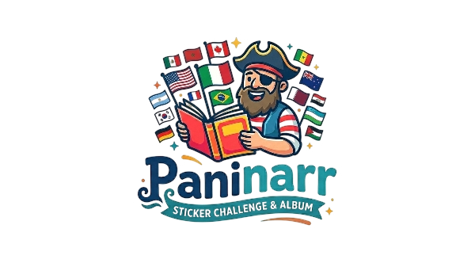

<p align="center"> Paninarr — 2026 FIFA World Cup Sticker Album </p>

<p align="center">
  
</p>

A full-stack web app for collecting, trading, and managing a digital sticker album for the **2026 FIFA World Cup**. Includes real player squads from all 48 qualified nations, FIFA API image resolution, admin photo management, a bilingual quiz, pack opening, trade system, and a live tournament simulation.

## 📸 Screenshots


## Features

### Sticker Collection
- **1350+ stickers**: 48 teams × 26 players + 48 managers + 16 stadiums + 16 host cities + 24 legends + 4 trophies
- **Real squads**: Every player matches the official FIFA API squad for World Cup 2026
- **4 rarities**: Common → Rare → Epic → Legendary
- **24 World Cup legends** (Pelé, Maradona, Messi, Ronaldo, Zidane, etc.)

### Image Resolution
- **FIFA API integration**: Automatically fetches official player photos from FIFA's CDN
- **Wikipedia fallback**: Resolves images for legends, stadiums, host cities, and trophies
- **Admin Upload**: Manually upload any player photo from your local machine
- **Image Search**: Search the web for alternative images
- **Drag-to-pan**: Adjust image crop position interactively
- **Local caching**: Store all resolved images locally so they survive API changes

### Pack System
- Open sticker packs with 5 random stickers each
- Collect duplicates for trading

### Swap / Trade System
- Find traders who need your duplicates and have stickers you need
- One-click swap execution
- Visual trade cards with sticker photos and duplicate counts

### Tournament Simulation
- **Real 2026 group draw**: All 12 groups (A–L) with actual FIFA draw results
- **Poisson-based scoring**: Realistic match simulation weighted by team strength
- **3-click flow**: Group Stage → R32→R16→QF batch → SF→Final
- **Interactive bracket**: Zoom (Ctrl+scroll), drag-to-pan, hover highlights
- **Per-user state**: Each user has their own independent simulation
- **Goal scorers**: Real player names from the sticker collection
- **Global champion aggregation**: See which team the community predicts

### Quiz (Bilingual)
- English and Arabic support
- Language dropdown switcher
- No duplicate questions
- XP rewards for correct answers

### Winner Prediction & Ultimate Reward
- During registration, each user **predicts who will win the 2026 World Cup**
- After the real tournament concludes, an admin sets the actual winner via the admin panel
- Any user who predicted correctly can claim the **Ultimate Champion** badge, which **unlocks every sticker** in the album
- One-time claim — no exploit possible

### Admin Panel
All admin features are accessible from the **Catalog page** after entering your admin key:
- Resolve all player images from FIFA
- Resolve non-player stickers (legends, stadiums, etc.) from Wikipedia
- Cache all resolved images locally
- Set image crop position globally
- Upload photos per player
- Search and set images per player
- Drag-to-pan individual sticker images
- Per-team FIFA squad audit
- Per-team image resolution

## Tech Stack

| Layer | Technology |
|-------|-----------|
| Frontend | **React 19**, Vite 6, Tailwind CSS 4, Motion (Framer Motion), shadcn/ui |
| Backend | **Express**, better-sqlite3 |
| Language | **TypeScript** (both frontend & backend) |
| Build | esbuild (server), Vite (client) |
| Database | **SQLite** (single file, zero config) |

## Getting Started

### Prerequisites
- Node.js 20+
- npm

### Installation

```bash
# Clone the repository
git clone https://github.com/your-username/paninarr.git
cd paninarr

# Install dependencies
npm install
```

### Development

```bash
npm run dev
```

This starts both the Express server (port 3001) and Vite HMR (for hot reloading).

Open http://localhost:24780 (Vite dev server) in your browser.

### Production Build

```bash
npm run build
npm start
```

The production server runs on port 3001 and serves the built frontend from `dist/`.

## Admin Access

An **admin account** is created automatically on first run:
- **Recovery code**: `ADMIN-0000-0000-0000`
- Log in via the **Returning** tab with this recovery code
- All 1356 stickers are pre-unlocked, and admin buttons appear in the Catalog

You can then run image resolution in this order:
1. **Resolve All from FIFA** — fetches 1084+ player photos from the official FIFA API
2. **Resolve Others (Wiki)** — resolves legends, stadiums, cities, and trophies from Wikipedia
3. **Cache All Photos Locally** — downloads all resolved images to `public/fifa-cache/`

## Project Structure

```
paninarr/
├── src/                    # React frontend
│   ├── components/         # UI components
│   ├── context/            # Auth & game context
│   ├── lib/                # API client
│   ├── pages/              # Page components
│   ├── utils/              # Utilities (countryData, stickerImages)
│   ├── App.tsx             # Router setup
│   └── main.tsx            # Entry point
├── public/                 # Static assets
│   ├── fifa-cache/         # Cached FIFA player images
│   ├── player-uploads/     # Admin-uploaded images
│   └── wc2026-logo.svg     # Official 2026 World Cup logo
├── data/                   # Runtime data
│   ├── manual-image-overrides.json  # Image override registry
│   └── worldcup.db         # SQLite database
├── server.ts               # Express backend (all routes, DB, migrations)
├── .env.example            # Environment template
└── package.json
```

### Key Files

| File | Purpose |
|------|---------|
| `server.ts` | **Entire backend** — DB schema, migrations, 50+ API endpoints, FIFA API integration, image resolution, tournament simulation |
| `src/pages/Catalog.tsx` | Main sticker catalog with admin panel, drag-to-pan, upload, search |
| `src/pages/Trades.tsx` | Swap/trade system with duplicate cards |
| `src/pages/Simulation.tsx` | Tournament simulation with bracket visualization |
| `src/utils/stickerImages.ts` | Image URL resolution, `imagesMap` for static stickers |
| `src/utils/countryData.ts` | Country flags, names, and team data |

## API Endpoints

### Authentication (user)
| Method | Path | Description |
|--------|------|-------------|
| POST | `/api/auth/register` | Create a new account (returns recovery code) |
| POST | `/api/auth/login` | Login with recovery code |
| GET | `/api/me` | Get current user data |

### Stickers & Packs
| Method | Path | Description |
|--------|------|-------------|
| GET | `/api/stickers` | List all stickers with image overrides |
| GET | `/api/my-stickers` | Get the current user's sticker collection |
| POST | `/api/packs/open` | Open a sticker pack (costs coins) |
| POST | `/api/swaps/find` | Find potential swap partners |
| POST | `/api/swaps/execute` | Execute a swap |

### Tournament Simulation
| Method | Path | Description |
|--------|------|-------------|
| GET | `/api/tournament/state` | Get current simulation state |
| POST | `/api/tournament/simulate` | Run next phase (groups/R32→QF/SF→Final) |
| POST | `/api/tournament/reset` | Reset simulation (3 uses max) |
| GET | `/api/tournament/global-champion` | Aggregated community champion picks |

### Admin (require `x-user-id: admin` header — the admin user logged in via recovery code `ADMIN-0000-0000-0000`)
| Method | Path | Description |
|--------|------|-------------|
| GET | `/api/admin/image-search?q=...` | Search for player images |
| POST | `/api/admin/set-image` | Manually set a sticker image |
| POST | `/api/admin/upload-image` | Upload an image (base64) |
| POST | `/api/admin/remove-image` | Remove a sticker override |
| POST | `/api/admin/set-image-position` | Adjust image crop position |
| POST | `/api/admin/set-all-positions` | Set position for all overrides |
| POST | `/api/admin/resolve-all-fifa` | Batch-resolve player images from FIFA API |
| POST | `/api/admin/resolve-all-generic` | Batch-resolve non-player stickers from Wikipedia |
| POST | `/api/admin/resolve-team` | Resolve images for a single team |
| POST | `/api/admin/cache-fifa-photos` | Download all resolved images locally |
| POST | `/api/admin/audit-team` | Compare DB squad vs FIFA API |
| POST | `/api/admin/set-winner` | Set the real 2026 World Cup winner (triggers prediction rewards) |
| GET | `/api/badges` | List available badges |
| POST | `/api/badges/claim` | Claim the Ultimate Champion badge (if your prediction was correct — unlocks all stickers) |

## Database

The app uses SQLite via `better-sqlite3`. The database file is `data/worldcup.db` and is **created automatically** on first run.

### Schema includes:
- `users` — player accounts with XP, coins, level, streak, favorite team
- `stickers` — all 1350+ sticker definitions with names, categories, rarities
- `user_stickers` — per-user ownership and duplicate tracking
- `quiz_questions` — bilingual (English/Arabic) quiz questions
- `quiz_progress` — per-user quiz answers
- `user_badges` — claimed badges
- `swaps` — trade records

Migrations are applied automatically on server startup.

## FIFA Image Resolution

The app integrates with FIFA's public API to fetch official player photos:

```
GET https://api.fifa.com/api/v3/teams/{teamId}/squad?idCompetition=17&idSeason=285023&language=en
```

- **No authentication required** — uses FIFA's public REST API
- **48 team IDs** are pre-mapped for all qualified nations
- Player matching uses fuzzy name matching (handles accents, Turkish characters, Korean romanization, umlauts)
- A `NAME_ALIASES` map resolves known name discrepancies between the sticker database and FIFA's naming

### Image resolution priority:
1. Manual upload / override (highest priority)
2. Local cache (`public/fifa-cache/{stickerId}.jpg`)
3. FIFA CDN (`digitalhub.fifa.com/transform/...`)
4. Wikipedia page images (fallback for legends and non-player stickers)

## Simulation Details

- **48 teams**, 12 groups of 4
- Top 2 from each group + 8 best third-placed teams advance to R32
- Single-elimination knockout from R32 onward
- Scores generated using **Poisson distribution** weighted by team strength ratings
- Extra time and penalties for drawn knockout matches
- Goal scorers are real player names from the sticker collection
- Each user has their own independent simulation state

## Acknowledgments

- **FIFA** for the public squad API and player images
- **Wikipedia** and **Wikimedia Commons** for legend and stadium images
- **Wikimedia Commons** for the 2026 World Cup emblem SVG
- All player and team data belongs to their respective rights holders
